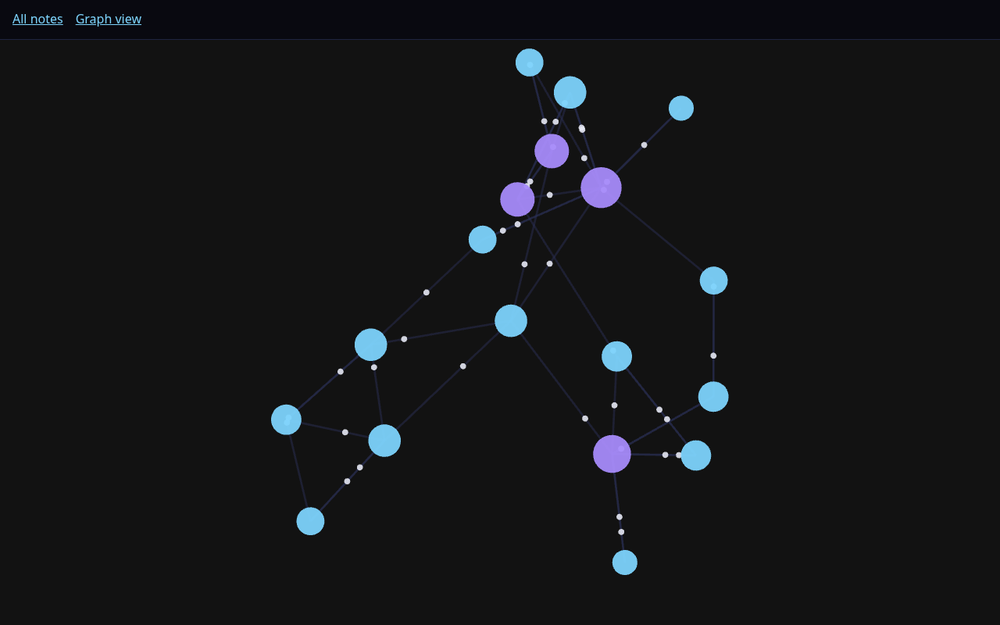

# enastro

**enastro** は、[Obsidian](https://obsidian.md/) の vault（ノートの保管フォルダ）の中から
「公開してよいノートだけ」を選んで、プライバシーを守りながら星空のような
Knowledge Graph サイトとして書き出す CLI ツールです。

サーバーもデータベースも不要です。生成されるのは HTML と JSON だけの静的ファイル一式なので、
GitHub Pages のような無料の静的ホスティングにそのまま置くだけで公開できます。

## デモ



実際に動く例を GitHub Pages 上に公開しています: **https://s8sato.github.io/enastro/**

（このデモは [fixtures/demo-vault](fixtures/demo-vault) というサンプル vault を、
このリポジトリの CI が自動でビルド・公開しているものです。）

## これは何がうれしいのか

- 手元の Obsidian vault には、人に見せたいノートと、見せたくない下書き・日記・秘密のメモが
  混在していますよね。enastro は、ノートの frontmatter に `publish: true` と書いたものだけを
  公開します。
- 公開しないノートへのリンク・タグ・別名（alias）・そのノートが存在すること自体が、
  公開されたサイトから一切わからないように作られています（**privacy invariant**）。
  「うっかり非公開メモの内容が漏れる」ことを防ぐのが、このツールの一番の目的です。
- ノート同士のつながりは、リンクの一覧（backlink）だけでなく、星空のように光る点と線として
  眺めることもできます（Graph view）。

詳しい設計思想は [spec/00-product-vision.md](spec/00-product-vision.md) を参照してください。

## クイックスタート（非エンジニア向け）

必要なもの: [Node.js](https://nodejs.org/)（バージョン 22 以上を推奨）がインストール済みのこと。

1. このリポジトリを取得し、依存関係をインストールします。

   ```bash
   git clone https://github.com/s8sato/enastro.git
   cd enastro
   npm install
   npm run build
   ```

2. 公開したい Obsidian vault の中で、公開したいノートの frontmatter（ファイル先頭の `---` で
   囲まれた部分）に `publish: true` を追加します。

   ```markdown
   ---
   publish: true
   tags: [公開したいノート]
   ---

   # ノートのタイトル

   本文...
   ```

3. サイトを生成します。

   ```bash
   npx enastro <あなたのvaultのパス> [出力先フォルダ（省略時は ./dist）]
   ```

4. 生成された出力フォルダ（既定では `dist/`）を、任意の静的サーバーで表示して確認します。

   ```bash
   npx http-server dist
   ```

   （`file://` として直接ブラウザで開くと、検索機能などが動かない場合があります。必ず
   何らかの http サーバー経由で開いてください。）

5. 問題なければ、`dist/` フォルダの中身をそのまま GitHub Pages 等の静的ホスティングにアップロード
   すれば公開完了です。

## GitHub Pages への自動公開（エンドユーザー向けテンプレート）

自分の vault を、毎回手作業でアップロードするのではなく、GitHub Actions で自動的に
GitHub Pages へ公開したい場合は、次のような workflow を自分のリポジトリの
`.github/workflows/deploy.yml` としてコピー&ペーストしてください
（[ADR-0013](decisions/ADR-0013-ci-github-pages-pipeline-scope.md)）。

```yaml
name: Deploy my vault to GitHub Pages

on:
  push:
    branches: [main]
  workflow_dispatch:

permissions:
  contents: read
  pages: write
  id-token: write

concurrency:
  group: pages
  cancel-in-progress: false

jobs:
  build:
    runs-on: ubuntu-latest
    steps:
      - uses: actions/checkout@v4
      - uses: actions/setup-node@v4
        with:
          node-version: 22
      - run: npx enastro ./my-vault ./dist
      - uses: actions/configure-pages@v5
      - uses: actions/upload-pages-artifact@v3
        with:
          path: dist

  deploy:
    needs: build
    runs-on: ubuntu-latest
    environment:
      name: github-pages
      url: ${{ steps.deployment.outputs.page_url }}
    steps:
      - id: deployment
        uses: actions/deploy-pages@v4
```

`./my-vault` の部分を自分の vault のパスに書き換え、リポジトリの
「Settings → Pages → Source: GitHub Actions」を一度だけ有効にすれば、`main` ブランチへの
push のたびに自動でサイトが更新されます。

このテンプレートは enastro が代わりに公開してくれるものではなく、**あなた自身のリポジトリ**で
動く独立した workflow です。private リポジトリから public リポジトリへの自動ミラーリングは
現時点では未対応です（引き続き検討中）。

## v0.1 / v0.2 でできること

- Markdown frontmatter（`publish`, タグ相当のフィールド）の解釈
- wikilink `[[note]]` / alias 付き `[[note|alias]]` / embed `![[note]]` / `#tag` の解釈
- 非公開ノートへの参照を安全に除去した public projection の生成
- 添付ファイルは allowlist マークがある場合のみ公開
- 決定的（deterministic）な静的 artifact の生成（同一入力 → 同一 content-hash）
- ノートごとの backlink 表示、全文検索、タグによる検索・フィルタリング
- レスポンシブレイアウト・タッチ操作対応の Graph view（星空グラフ、pan/zoom/pinch/クリック対応）
- GitHub Actions による CI（typecheck・test）と、GitHub Pages への自動デモ公開

MCP/CLI query interface などは引き続き対象外です。詳細は
[spec/01-scope-and-requirements.md](spec/01-scope-and-requirements.md) §3 を参照してください。

## 開発者向け

```bash
npm test         # vitest によるテスト一式（unit / golden / privacy scan / security / compatibility / e2e）
npm run typecheck
npm run build
```

- `spec/` — 正本となる仕様書（要件・アーキテクチャ・受け入れ基準など）
- `decisions/ADR-*.md` — 個々の設計判断（Architecture Decision Record）
- `fixtures/` — 各 REQ の検証に使う vault fixture 群（`fixtures/demo-vault` は上記デモサイトの元データ）
- `LOOP.md` — 実装作業の進め方（loop engineering）
- `AGENTS.md` — このリポジトリで作業するすべてのエージェント・開発者に適用される規約

性能測定（10,000 nodes / 50,000 edges の代表データセットに対する build 時間・Graph UI の応答性）は
[spec/07-performance.md](spec/07-performance.md) と
`npm run generate:benchmark-vault && npm run bench` を参照してください。

仕様と実装の対応関係（traceability）は
[spec/01-scope-and-requirements.md](spec/01-scope-and-requirements.md) §5 および
[spec/09-acceptance-and-evaluation.md](spec/09-acceptance-and-evaluation.md) を参照してください。

## ライセンス

[Apache License 2.0](LICENSE)（[ADR-0007](decisions/ADR-0007-oss-license.md) 参照）。
